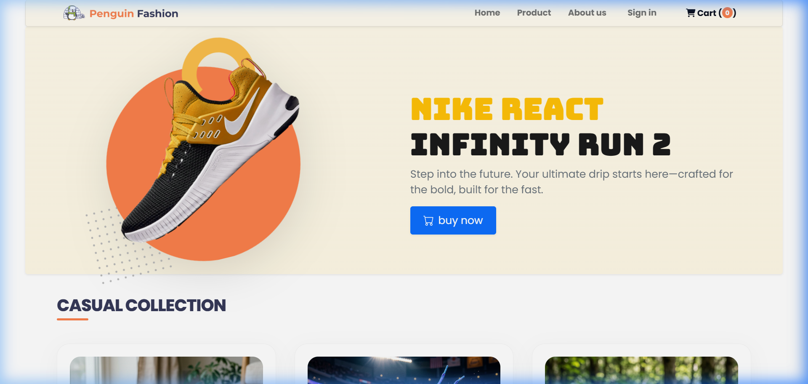
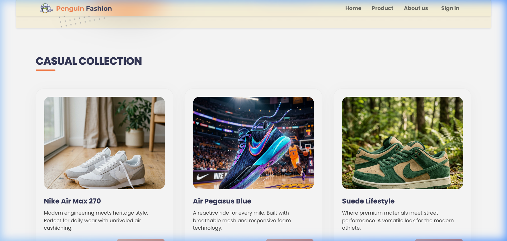
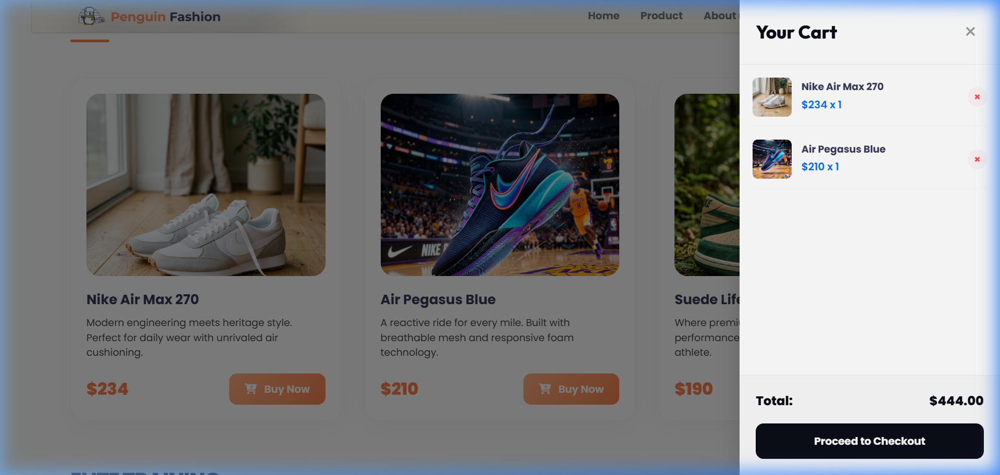

<div align="center">
  
  <h1>👟 Nike React: Infinity Fun Edition</h1>
  <h3>[🚀 Explore the Live Demo](https://nike-react-infinity-fun.netlify.app/)</h3>
</div>

---

## ✨ Project Vision
A premium, interactive, and "funky" storefront redesign for the **Nike React Infinity** collection. This project combines a modern urban aesthetic with high-end UI elements to create a seamless and professional shopping experience.

---

## 🛍️ Premium Shopping Vibe
*Experience retail reimagined with specialized animations and interactive logic.*



---

## 📸 Interactive Showcase
*Verified through automated browser playback and comprehensive UI testing.*

| Storefront & Glassy UI | Smart Shopping Cart |
| :---: | :---: |
|  |  |
| *Premium Glassmorphism & High-End Layout* | *Real-time Total Calculation & Logic* |

---

## 🚀 Key Features

- **💎 Elite Glassmorphism**: Translucent navigation bar with high-end backdrop-blur, saturation, and subtle border effects.
- **🛒 Dynamic Sidebar Cart**: Fully interactive cart system allowing users to add/remove products and view real-time totals without leaving the page.
- **🧱 "Boxed" Modern Layout**: Clean, elegant sectioning inspired by modern premium streetwear brands.
- **🔐 Secure Sign-In Portal**: A dedicated, minimal login page for returning athletes and sneakerheads.
- **⚡ Seamless UX**: Smooth auto-scroll navigation for hero actions and optimized hover-swap image effects for 360-degree product views.
- **🏙️ Urban Typography**: Unique "funky" font pairings (Bungee + Outfit) for a bold street-style personality.

---

## 🛠️ Technical Stack

- **Core Engine**: Vanilla HTML5, CSS3, and modern JavaScript (ES6+).
- **Styling Framework**: **Bootstrap 5** for responsive grid layouts and robust utility foundations.
- **Build System**: **Vite** for optimized development and production bundles.
- **Interactive UI**:
  - `backdrop-filter` for glassmorphism.
  - Custom JS DOM manipulation for the shopping cart system.
- **Resources**:
  - **Google Fonts**: Bungee & Outfit.
  - **Font Awesome**: Premium icon sets.

---

## 📦 Getting Started

1.  **Clone the Repository**:
    ```bash
    git clone https://github.com/WahidaAkhter/Nike-React.git
    ```
2.  **Environment Setup**:
    ```bash
    npm install
    ```
3.  **Local Development**:
    ```bash
    npm run dev
    ```
    *Local preview available at `http://localhost:5173/`*

---

## 📂 Project Structure

- `index.html`: Main retail landing hub and storefront.
- `login.html`: Secure user authentication portal.
- `style.css`: Comprehensive design system and custom animations.
- `docs/screenshots/`: Visual verification assets from the design process.

---

*Coded with ⚡ and modern engineering principles for a premium Nike fan experience.*
